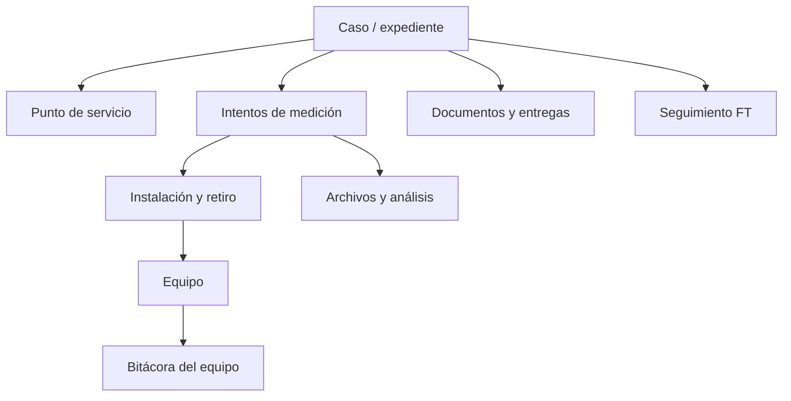

# Arquitectura propuesta para el rediseño de NetTracker

Estado: propuesta inicial para discusión  
Fecha: 2026-10-04  
Alcance: CPT MT y CPT BT, empezando por trazabilidad caso–equipo

## 1. Objetivo

Convertir NetTracker en el sistema operativo del trabajo de CPT: un lugar donde cada caso conserve su historia completa desde que se recibe hasta que se entrega o se cierra, incluyendo equipos, visitas, archivos, cálculos, documentos, plazos y seguimientos.

El rediseño debe evolucionar la aplicación actual sin perder lo que ya funciona. No se propone reescribirla completa ni cambiar de tecnología en la primera etapa.

La decisión central es esta:

> El **caso** será el expediente principal. Una instalación, una medición, un equipo o un documento nunca deberán existir como datos aislados: estarán relacionados con el caso que explica por qué se generaron.

## 2. Qué se conserva de la aplicación actual

La aplicación ya resuelve partes valiosas que deben reutilizarse:

- PWA adaptable a teléfono y computadora.
- Firebase Realtime Database y sincronización en tiempo real.
- Registro manual y carga masiva de instalaciones.
- Inventario de analizadores, ubicación, condición, préstamos y mantenimiento.
- Instalación, retiro, descarga y registro de fallas.
- Validaciones de TAP.
- Despachos, memos y mapas.
- Separación por CPT MT y CPT BT.
- Pruebas de interfaz con una Firebase simulada.

No se debe romper ninguno de estos flujos mientras se incorporan los nuevos módulos.

## 3. Problemas estructurales actuales

Actualmente `analizadores` funciona como una mezcla de instalación, caso, retiro y descarga. El correlativo se guarda como texto y no existe un expediente de caso real.

Esto provoca que:

- No se pueda consultar toda la historia de un caso desde un único lugar.
- La relación con el equipo dependa del texto del correlativo y de historiales incrustados.
- Las fallas de medición y las fallas físicas del equipo puedan confundirse.
- Los estados de campaña, medición, cumplimiento, entrega y seguimiento FT se mezclen.
- Una remedición parezca otro registro independiente, aunque pertenezca al mismo caso.
- No exista una fuente única para generar el cuadro resumen.
- Los plazos y pendientes no sobrevivan naturalmente de una campaña a la siguiente.
- La carga Excel actualmente lea datos como NC, conexión, multiplicador y accesorios, pero no conserve todos en la instalación.

## 4. Modelo conceptual



Relaciones principales:

- Una campaña contiene muchos casos.
- Un caso pertenece a un punto de servicio y puede tener varios intentos de medición.
- Cada intento puede usar una instalación física y un analizador.
- Una remedición es un nuevo intento dentro del mismo caso.
- Un equipo tiene una bitácora cronológica; cada evento operativo indica el caso y la instalación que lo originaron.
- El seguimiento FT pertenece al caso, nace de una medición fuera de tolerancia y se cierra con una remedición válida y normalizada.

## 5. Tipos de expediente

Todos comparten el mismo núcleo, pero activan reglas distintas.

| Flujo | Tipo de caso | Reglas principales |
|---|---|---|
| Campaña | `CR`, `DA`, `DF` | Precampaña, multiplicadores, tres fechas, contratista, selección regulatoria, cuadro resumen y carga a CPT DELSUR |
| Reclamo | `RE` | Instalación directa por CPT, análisis integral, informe y carga dentro del plazo indicado |
| Especial | `ESPECIAL` | Medición y entrega configurables; sin análisis regulatorio ni seguimiento FT automático |

Campos de clasificación propuestos:

```js
{
  workflowType: 'campaign' | 'complaint' | 'special',
  caseType: 'CR' | 'DA' | 'DF' | 'RE' | 'SPECIAL',
  ownerArea: 'CPT MT' | 'CPT BT'
}
```

## 6. Entidades de dominio

### 6.1 Caso

Es el expediente permanente y la pantalla principal de consulta.

```js
cases/{caseId}: {
  code: 'CR112026201',
  normalizedCode: 'CR112026201',
  workflowType: 'campaign',
  caseType: 'CR',
  ownerArea: 'CPT MT',
  campaignId: 'campaignId-or-null',
  servicePointId: 'servicePointId',
  source: 'DGEHM',

  lifecycleStatus: 'preparation',
  multiplierStatus: 'pending_validation',
  measurementStatus: 'not_measured',
  complianceStatus: 'pending',
  submissionStatus: 'pending',

  assignedTo: 'userId',
  originalInstallationDate: null,
  activeFollowUpId: null,
  createdAt: 0,
  createdBy: 'userId',
  updatedAt: 0,
  updatedBy: 'userId'
}
```

El código visible no debe ser la llave técnica. Se usará un `caseId` generado y un índice para evitar duplicados:

```js
caseCodeIndex/{normalizedCode}: caseId
```

### 6.2 Campaña

Agrupa el mes, reglas, casos recibidos, fechas de trabajo y entrega.

```js
campaigns/{campaignId}: {
  year: 2026,
  month: 11,
  authority: 'DGEHM',
  ownerArea: 'CPT MT',
  receivedAt: '2026-09-20',
  plannedInstallationDates: ['2026-11-02', '2026-11-03', '2026-11-04'],
  submissionDueAt: '2026-12-10',
  status: 'pre_campaign',
  ruleVersion: '38-E-2015/v1'
}
```

La campaña puede cerrarse aunque uno o más casos continúen en seguimiento FT.

### 6.3 Punto de servicio

Evita repetir datos del cliente en cada medición y permite conservar cambios de medidor, dirección o referencia eléctrica.

```js
servicePoints/{servicePointId}: {
  contractNumber: '200049101',
  customerName: '...',
  address: '...',
  meterNumber: '...',
  electricalReference: 'CT4260',
  feeder: 'AL013',
  networkVoltageLL: 23000,
  urbanity: 'U',
  coordinates: { lat: 0, lng: 0 },
  active: true
}
```

Los documentos regulatorios deben conservar una copia de los datos usados al generarlos, aunque después cambie el punto de servicio.

### 6.4 Intento de medición

Representa una medición original, repetición por falla o remedición FT.

```js
measurementRuns/{measurementRunId}: {
  caseId: 'caseId',
  sequence: 1,
  purpose: 'original', // original | retry | ft_remeasurement | diagnostic
  installationId: 'installationId',
  ruleVersion: '38-E-2015/v1',
  validityStatus: 'pending',
  complianceStatus: 'pending',
  febNoPer: null,
  selectedForSubmission: false,
  selectionReason: null,
  processingRunId: null,
  createdAt: 0
}
```

La validez y el cumplimiento son conceptos diferentes:

- `validityStatus`: si los datos sirven técnicamente (`valid`, `failed`, `invalid`, `warning`).
- `complianceStatus`: si el suministro quedó dentro o fuera de tolerancia (`within`, `outside`, `pending`).
- `submissionStatus`: si corresponde entregar y si ya se cargó (`pending`, `selected`, `uploaded`, `rejected`, `not_required`).

### 6.5 Instalación física

Evoluciona el nodo actual `analizadores`. Describe dónde estuvo físicamente el equipo y qué ocurrió en campo.

```js
installations/{installationId}: {
  caseId: 'caseId',
  measurementRunId: 'measurementRunId',
  equipmentId: 'equipmentId',
  installerType: 'contractor', // cpt | contractor
  plannedInstallAt: '2026-11-02',
  actualInstallAt: null,
  plannedRemovalAt: '2026-11-10',
  actualRemovalAt: null,
  locationSnapshot: { name: '...', address: '...', lat: 0, lng: 0 },
  electricalSetupSnapshot: {},
  accessoriesSnapshot: {},
  status: 'planned',
  downloadStatus: 'pending',
  fieldNotes: ''
}
```

En la primera migración no se renombrará físicamente `analizadores`; se añadirán `caseId` y `measurementRunId` para mantener compatibilidad. El cambio a `installations` puede hacerse después mediante repositorios.

### 6.6 Equipo

El registro del equipo conserva su ficha y un resumen de su estado actual:

```js
equipment/{equipmentId}: {
  serialNumber: '...',
  model: 'ECAMEC',
  assetTag: '...',
  operationalState: 'available',
  condition: 'good',
  currentLocation: 'Cucumacayán',
  activeInstallationId: null,
  updatedAt: 0
}
```

Se separan tres conceptos que hoy se mezclan:

- **Estado operativo:** disponible, asignado, prestado, instalado, en mantenimiento o fuera de servicio.
- **Condición:** bueno, con detalles o dañado.
- **Ubicación:** Cucumacayán, Plantel Central, contratista, cliente u otra sede.

El resumen actual facilita las listas; la evidencia histórica vive en la bitácora.

### 6.7 Bitácora de equipo

Esta es la pieza clave para la trazabilidad solicitada. Los eventos se agregan y no se sobrescriben.

```js
equipmentEvents/{eventId}: {
  equipmentId: 'equipmentId',
  caseId: 'caseId-or-null',
  measurementRunId: 'measurementRunId-or-null',
  installationId: 'installationId-or-null',
  type: 'installed',
  occurredAt: 0,
  actorId: 'userId',
  actorName: '...',
  from: { state: 'assigned', location: 'Contratista', condition: 'good' },
  to: { state: 'installed', location: 'Cliente', condition: 'good' },
  failure: null,
  notes: '',
  documentIds: []
}
```

Tipos iniciales de evento:

- `registered`
- `assigned`
- `installation_updated`
- `installation_deleted`
- `unassigned`
- `dispatched`
- `installed`
- `removed`
- `returned`
- `downloaded`
- `incident_reported`
- `sent_to_review`
- `maintenance_started`
- `maintenance_completed`
- `condition_changed`
- `retired_from_service`

Una falla registrada al retirar debe indicar, como mínimo:

```js
failure: {
  category: 'power_failure',
  description: 'No enciende / sin señales de vida',
  detectedAt: 0,
  causedMeasurementFailure: true,
  evidenceFileIds: []
}
```

Así, desde el inventario se podrá responder:

- En qué casos fue usado el equipo.
- Cuándo salió y regresó.
- Quién lo instaló y retiró.
- En qué cliente o ubicación estuvo.
- Qué falla tuvo y si invalidó la medición.
- Qué memo, fotografías y revisión se generaron.
- Cuándo volvió a estar disponible.

Y desde el caso se podrá ver la misma historia filtrada a ese expediente.

### 6.8 Archivos y procesamiento

Los archivos grandes no deben guardarse como arreglos dentro de Realtime Database.

```js
files/{fileId}: {
  caseId: 'caseId',
  measurementRunId: 'measurementRunId',
  kind: 'raw_pqx', // raw_pqx | exported_txt | photo | scan | report | memo
  storagePath: '...',
  originalName: '...',
  size: 0,
  sha256: '...',
  sourceFileId: null,
  uploadedAt: 0,
  uploadedBy: 'userId'
}
```

- `.pqx`: fuente virgen e inmutable.
- `.txt`: archivo derivado mediante el software del fabricante.
- Resultado del cálculo: datos resumidos en Firebase.
- Series grandes para gráficas: archivo procesado o almacenamiento especializado, no el registro principal del caso.

Cada cálculo debe registrar su versión para poder reproducirlo:

```js
processingRuns/{processingRunId}: {
  measurementRunId: 'measurementRunId',
  inputFileId: 'txtFileId',
  engineVersion: 'quality-engine/1.0.0',
  ruleVersion: '38-E-2015/v1',
  startedAt: 0,
  completedAt: 0,
  status: 'completed',
  result: {
    recordCount: 0,
    validRecordCount: 0,
    invalidRecordCount: 0,
    predominantIntervalMinutes: 15,
    columnCount: 74,
    febNoPer: 0,
    validityStatus: 'valid',
    complianceStatus: 'within',
    warnings: []
  }
}
```

Esto permitirá trasladar la macro a JavaScript sin perder la capacidad de comparar el resultado nuevo contra Excel.

### 6.9 Seguimiento FT

El seguimiento FT es independiente del cierre administrativo de la campaña.

```js
ftFollowUps/{followUpId}: {
  caseId: 'caseId',
  sourceMeasurementRunId: 'measurementRunId',
  startDate: '2026-10-01',
  deadlineDate: '2026-12-29',
  status: 'open',
  ownerId: 'userId',
  initialNoticeSentAt: null,
  compensation: {
    dailyAmount: null,
    effectiveFrom: null,
    lastCalculatedAt: null
  },
  closingMeasurementRunId: null,
  closedAt: null
}
```

El caso FT solo se cierra cuando exista una remedición:

1. técnicamente válida;
2. dentro de tolerancia; y
3. marcada expresamente como evidencia de cierre.

Las llamadas, correos, mediciones aledañas, memorandos, presupuestos, aprobaciones y obras se registran como acciones del seguimiento y pueden generar tareas.

### 6.10 Tareas, plazos y recordatorios

```js
tasks/{taskId}: {
  caseId: 'caseId-or-null',
  campaignId: 'campaignId-or-null',
  followUpId: 'followUpId-or-null',
  type: 'send_ft_notice',
  title: 'Avisar caso FT a DELSUR',
  dueAt: '2026-10-12',
  ownerId: 'userId',
  status: 'pending',
  priority: 'high',
  completedAt: null
}
```

Los plazos se calculan en un servicio centralizado, no en cada pantalla. Como mínimo:

- Entrega de campaña: día 10 del mes siguiente.
- Seguimiento FT: 90 días calendario desde la instalación original, contando el día de instalación.
- Reclamo: ocho días desde el retiro real, pendiente confirmar si son calendario y si el día del retiro cuenta.
- Requerimiento especial: fecha configurable recibida con la solicitud.

Una PWA estática puede mostrar alertas al abrirse, pero los avisos automáticos sin abrir la aplicación necesitarán posteriormente un proceso servidor, por ejemplo Cloud Functions y notificaciones o correo.

### 6.11 Rutas e índices en Realtime Database

Realtime Database no debe usarse como si realizara uniones relacionales. Además de los registros principales, se mantendrán índices livianos con identificadores para llegar rápido a las relaciones.

```text
cases/{caseId}
caseCodeIndex/{normalizedCode}
campaigns/{campaignId}
caseIdsByCampaign/{campaignId}/{caseId}
servicePoints/{servicePointId}
measurementRuns/{measurementRunId}
measurementRunIdsByCase/{caseId}/{measurementRunId}
analizadores/{installationId}                 # ruta actual durante la transición
installationIdsByCase/{caseId}/{installationId}
equipos/{equipmentId}                         # ruta actual conservada inicialmente
equipmentEvents/{eventId}
eventIdsByEquipment/{equipmentId}/{eventId}
eventIdsByCase/{caseId}/{eventId}
files/{fileId}
processingRuns/{processingRunId}
ftFollowUps/{followUpId}
tasks/{taskId}
documents/{documentId}
submissions/{submissionId}
```

Los índices solo guardan `true`, fecha o un resumen mínimo; no deben convertirse en copias divergentes de todo el objeto. La creación de un caso, instalación o evento actualizará el registro y sus índices en la misma escritura multipath.

## 7. Estados separados

No debe existir un único campo `estado` que intente representar todo.

| Dimensión | Ejemplos |
|---|---|
| Expediente | recibido, en precampaña, programado, en medición, en análisis, pendiente de entrega, cerrado, cancelado |
| Multiplicador | realizado, pendiente de validar, validado con usuario, validado con históricos, revisar, cliente de baja, acceso denegado |
| Instalación | planificada, instalada, retirada, devuelta, descarga pendiente, completada |
| Validez técnica | pendiente, válida, fallida, inválida, advertencia |
| Cumplimiento | pendiente, dentro de tolerancia, fuera de tolerancia |
| Entrega | no requerida, pendiente, seleccionada, cargada, rechazada |
| Seguimiento FT | no aplica, abierto, en diagnóstico, solución propuesta, en ejecución, pendiente de remedición, cerrado, vencido |
| Equipo | disponible, asignado, prestado, instalado, mantenimiento, fuera de servicio |

Esto evita errores como interpretar “medición fallida” como “equipo dañado” o cerrar un FT al cerrar la campaña.

## 8. Módulos de la aplicación

### Navegación funcional final

| Módulo | Función |
|---|---|
| Inicio | Pendientes personales, vencimientos, instalaciones/retiros, campañas y FT críticos |
| Casos | Buscador y expediente completo de CR, DA, DF, RE y especiales |
| Campañas | Importación, precampaña, multiplicadores, fechas, selección y cuadro resumen |
| Mediciones | Instalación, retiro, descarga, archivos, procesamiento y gráficas |
| Equipos | Inventario, disponibilidad, ubicación, condición y bitácora por caso |
| Seguimientos | FT, acciones, plazo de 90 días, remediciones y compensaciones |
| Entregas | Cuadros resumen, informes y constancia de carga a CPT DELSUR |
| Mapa | Casos, validaciones, instalaciones y puntos pendientes |

En móvil se conservarán cinco accesos principales y el resto quedará bajo “Más”.

### Evolución desde las pantallas actuales

| Actual | Evolución |
|---|---|
| Dashboard | Inicio operativo por persona y área |
| Instalaciones | Mediciones; conservará registro en campo y retiros |
| Inventario | Equipos con línea de tiempo vinculada a casos |
| Validaciones | Subproceso accesible desde campaña y caso; se mantiene durante la transición |
| Carga/Despachos | Parte de Campañas, sin quitar la vista actual inicialmente |
| Mapa | Vista transversal de casos e instalaciones |

## 9. Estructura de código propuesta

Se mantiene JavaScript por módulos y se separan reglas de negocio, acceso a datos e interfaz.

```text
js/
  domain/
    cases.js
    deadlines.js
    equipment.js
    measurements.js
    regulatory-rules.js
  data/
    repositories/
      cases-repository.js
      equipment-repository.js
      installations-repository.js
      measurements-repository.js
    firebase.js
    sync.js
  services/
    campaign-import.js
    case-timeline.js
    equipment-ledger.js
    measurement-processing.js
    regulatory-selection.js
    summary-builder.js
    task-generator.js
  features/
    cases/
      actions.js
      handlers.js
      views.js
    campaigns/
    measurements/
    equipment/
    follow-ups/
    submissions/
  views/
  handlers/
  actions/
```

Los directorios actuales continúan funcionando. Los nuevos módulos se incorporarán por función; no se hará una mudanza masiva de archivos.

Los repositorios permiten conservar inicialmente las rutas Firebase actuales aunque la interfaz ya use conceptos nuevos.

## 10. Reglas técnicas importantes

### Escrituras atómicas

Asignar un equipo a un caso afecta varios datos:

- instalación;
- estado actual del equipo;
- bitácora del equipo;
- actividad del caso.

Firebase debe guardar esos cambios con una actualización multipath atómica. Si una parte falla, no debe quedar el equipo “instalado” sin una instalación asociada.

### Eventos inmutables y correcciones

Los eventos históricos no se borran ni se reescriben silenciosamente. Una corrección crea un evento que referencia al anterior y deja auditoría de quién corrigió qué.

### Datos actuales derivados

`operationalState`, `currentLocation` y `activeInstallationId` son una fotografía para consultas rápidas. La bitácora es la evidencia. Debe existir una función que pueda recalcular la fotografía desde eventos.

### Idempotencia

Importar dos veces el mismo listado no debe duplicar casos. La combinación de código normalizado, campaña y área deberá validarse antes de crear.

### Zona horaria y fechas

Las fechas regulatorias deben interpretarse en la zona horaria de El Salvador. Se deben distinguir:

- fechas civiles, como `2026-11-10`;
- instantes, guardados con timestamp y zona de presentación;
- fechas planificadas y fechas reales.

## 11. Seguridad y archivos

El PIN local actual sirve como selección de perfil, pero no constituye autenticación suficiente para almacenar datos personales, fotografías y mediciones.

Antes de centralizar esa información se requiere:

- Firebase Authentication.
- Reglas de seguridad por rol y área.
- Roles como `admin`, `analyst_mt`, `analyst_bt`, `contractor_limited` y `read_only`.
- Firebase Storage o repositorio documental con permisos para PQX, TXT, fotografías, escaneos e informes.
- Registro de usuario y fecha para cada alta, edición, descarga y entrega.
- Copias de respaldo y procedimiento de recuperación.

Las credenciales o reglas administrativas no se deben incluir en el cliente publicado en GitHub Pages.

## 12. Migración incremental

### Fase 0 — Protección de la base actual

- Documentar el esquema Firebase real y crear un respaldo.
- Agregar `schemaVersion`.
- Asegurar pruebas de los flujos existentes.
- Definir catálogos de estados y códigos de falla.

### Fase 1 — Casos y trazabilidad de equipos

Es la primera fase recomendada porque resuelve la necesidad inmediata.

- Crear `cases` y `caseCodeIndex`.
- Añadir `caseId` a instalaciones nuevas y existentes.
- Crear `equipmentEvents`.
- Convertir instalación, retiro, devolución, daño, revisión y mantenimiento en eventos.
- Mostrar la línea de tiempo desde el caso y desde el equipo.
- Mantener los historiales actuales en paralelo hasta verificar la migración.

### Fase 2 — Campañas y precampaña

- Importar una sola vez el listado oficial.
- Crear CR, DA y DF relacionados correctamente.
- Enriquecer NC, medidor, CT/DS, coordenadas y configuración.
- Generar listado, mapa, hojas de inspección y cartas.
- Registrar envío a firma, entrega al contratista y recepción de fotos/hojas.
- Incorporar multiplicadores, estados y validaciones de TAP.
- Programar las tres fechas y generar despachos/memos desde la misma campaña.

### Fase 3 — Ingesta y cálculo de mediciones

- Cargar PQX como respaldo y TXT como entrada de cálculo.
- Trasladar las reglas de la macro a un motor JavaScript versionado.
- Validar 74/197 columnas, intervalos, registros mínimos y fechas.
- Calcular registros inválidos, RegFT, FebNoPer y resultado.
- Comparar resultados contra una colección de archivos ya calculados en Excel.
- Crear gráficas y métricas adicionales para reclamos.

### Fase 4 — Cuadro resumen y entrega

- Incluir todos los casos del mes, incluso no medidos, bajas y accesos denegados.
- Aplicar mínimos y selección de correlativos para CR, DA y DF.
- Coordinar disponibilidad de perturbaciones entre CPT MT y CPT BT.
- Generar el cuadro resumen.
- Registrar qué se envió y qué se cargó manualmente a CPT DELSUR.
- Alertar antes del día 10 del mes siguiente.

### Fase 5 — Reclamos e informes

- Registrar reclamo desde el correo recibido.
- Programar instalación y retiro por personal CPT.
- Procesar regulación, Pst, armónicos y demás indicadores.
- Generar gráficas e informe usando una plantilla aprobada.
- Controlar el plazo de ocho días y la carga al sistema.

### Fase 6 — Seguimientos FT

- Crear automáticamente el seguimiento al confirmar fuera de tolerancia.
- Generar la tarea urgente de aviso a DELSUR.
- Controlar 90 días, hitos, responsables y evidencia.
- Registrar compensación diaria cuando sea informada.
- Relacionar remediciones y validar el cierre.

### Fase 7 — Requerimientos especiales y formatos

- Flujo configurable de medición y entrega.
- Gráficas o archivos según solicitud.
- Renovación visual de cartas, hojas, memos e informes.

## 13. Primer incremento implementable

El primer cambio de código debería ser pequeño y comprobable:

> **Crear el expediente de caso y enlazarlo con las instalaciones y el inventario, sin cambiar todavía la lógica regulatoria.**

### Alcance

1. Crear un caso manual o al guardar una instalación cuyo correlativo todavía no exista.
2. Guardar `caseId` en la instalación además del texto `caso` usado actualmente.
3. Registrar eventos al asignar, instalar, retirar, devolver y reportar una falla.
4. Mostrar en el detalle del equipo una cronología con enlace al caso.
5. Mostrar en el detalle del caso el equipo, ubicación, fechas, fallas y documentos asociados.
6. Impedir dos instalaciones activas simultáneas para el mismo equipo.
7. Conservar memos, despachos, validaciones y pantallas actuales.

### Criterios de aceptación

- Buscar `CR112026201` abre un único expediente.
- El expediente muestra todos sus intentos y equipos, no solo la última instalación.
- El equipo muestra que estuvo instalado en `CR112026201`, dónde y durante qué fechas.
- Si falló, se ve categoría, descripción, evidencia, efecto en la medición y tratamiento posterior.
- Una remedición se agrega al mismo expediente con secuencia diferente.
- Los eventos no se pierden al modificar el estado actual del equipo.
- La migración puede ejecutarse de nuevo sin duplicar casos o eventos.
- Las pruebas existentes continúan pasando y se agregan pruebas para estas relaciones.

## 14. Decisiones pendientes antes de automatizar cálculos y plazos

Estas preguntas no bloquean la Fase 1, pero deben resolverse antes de las fases correspondientes:

1. En reclamos, confirmar si los ocho días son calendario o hábiles y si el día de retiro cuenta como día uno.
2. Definir la regla exacta de acumulación y redondeo de compensación diaria.
3. Obtener el formato real del cuadro resumen y las plantillas finales de informes.
4. Documentar todas las columnas y fórmulas de Pst, armónicos y demás análisis de reclamos.
5. Confirmar dónde se almacenarán PQX, TXT, fotografías y escaneos y cuál es su tamaño habitual.
6. Definir qué acciones podrá hacer el contratista dentro de la app.
7. Acordar quién puede corregir códigos, resultados, fechas regulatorias y cierres FT.

## 15. Principio de trabajo para los siguientes cambios

Cada fase se dividirá en cambios pequeños. Antes de programar cada uno se acordarán:

- alcance exacto;
- estructura de datos afectada;
- compatibilidad con registros anteriores;
- criterio de aceptación;
- prueba automática correspondiente;
- forma de reversión o migración.

Esta arquitectura es el mapa de destino; no autoriza una reescritura masiva ni una migración automática de la base real sin revisión previa.
